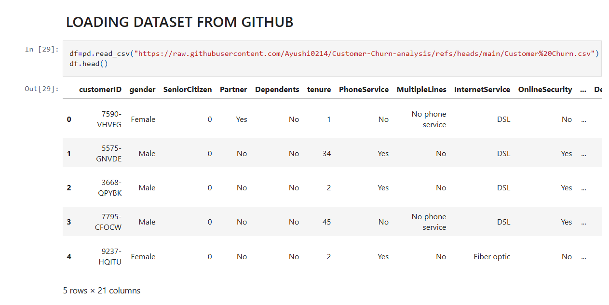

📊 Exploratory Data Analysis (EDA) Project
This project showcases the complete process of Exploratory Data Analysis (EDA) using Python. EDA is a critical step in any data science workflow as it helps uncover patterns, spot anomalies, test hypotheses, and check assumptions with the help of summary statistics and graphical representations.

🔍 Objective
The goal of this project is to:

Understand the structure and quality of the dataset

Clean and preprocess the data

Visualize the data using statistical plots

Derive meaningful insights to inform further analysis or modeling

🧰 Tools & Libraries Used
Library	Purpose
pandas	Data manipulation and cleaning
numpy	Numerical computations
matplotlib	Data visualization (basic charts)
seaborn	Statistical data visualization (advanced)
Jupyter	Interactive Python notebook environment

📌 Key Tasks Performed

✅ Import and inspect dataset

✅ Identify and handle missing values

✅ Understand column types and distributions

✅ Perform univariate and bivariate analysis

✅ Create visualizations to detect trends and relationships

✅ Use correlation heatmaps and pairplots for multivariate analysis

✅ Summarize key findings

📊 Visualizations Included
Histograms and Boxplots (distribution & outlier detection)

Countplots (category analysis)

Correlation Heatmap (relationship between numerical features)

Pairplots and Scatterplots (bivariate insights)

Bar plots and Pie charts for categorical breakdowns

## 🖼️ Sample Screenshots

### 🔹 Dataset Head (First 5 Rows)

### 🔹 Churn Distribution by Tenure

### 🔹 Countplots for Categorical Features vs Churn

🎯 Skills Demonstrated

Data cleaning and preprocessing

Visual storytelling through plots

Statistical understanding of data

Hands-on experience with Python for data analysis

📬 **Contact**  
For feedback, suggestions, or collaboration, feel free to reach out via:  

**GitHub**: [umar9643](https://github.com/umar9643)  
**LinkedIn**: [Umar Alam's Profile](https://www.linkedin.com/in/umar-alam-a1b2c3)  
**Email**: [alamumar258455@gmail.com](mailto:alamumar258455@gmail.com)

